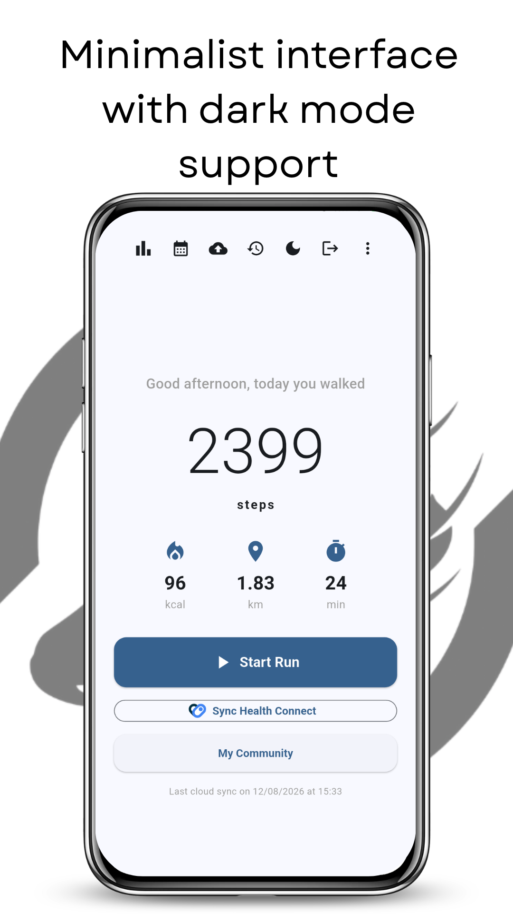
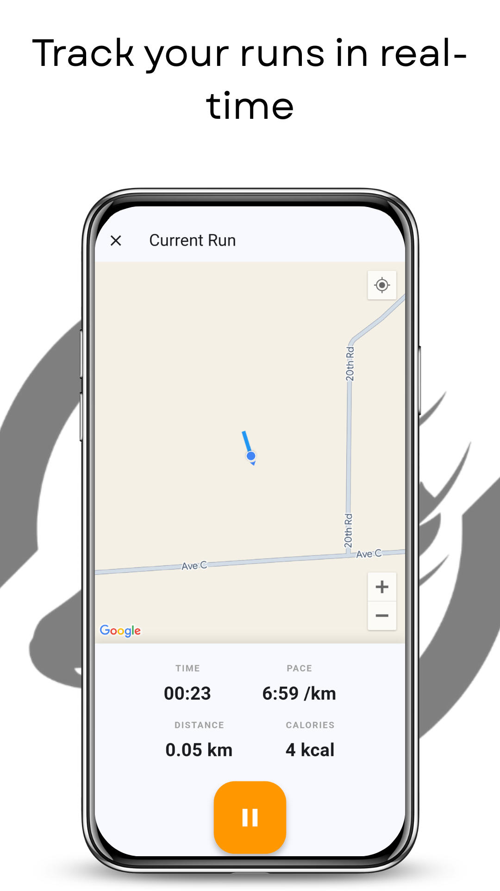
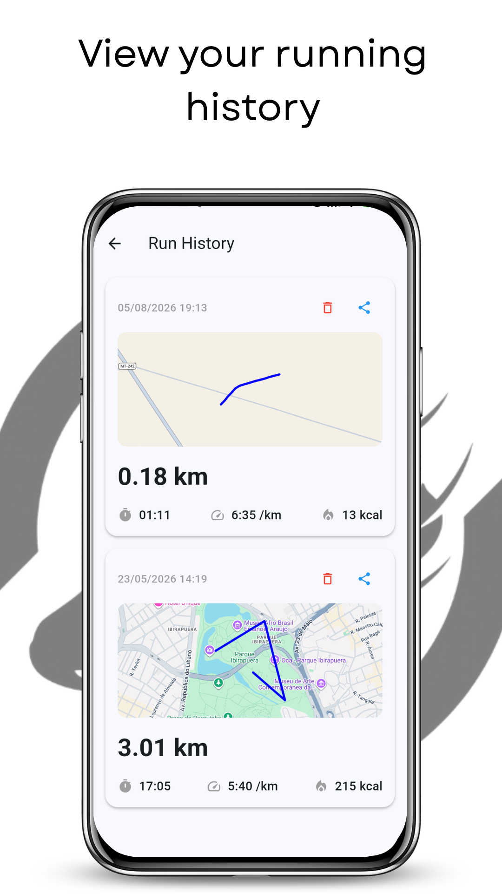
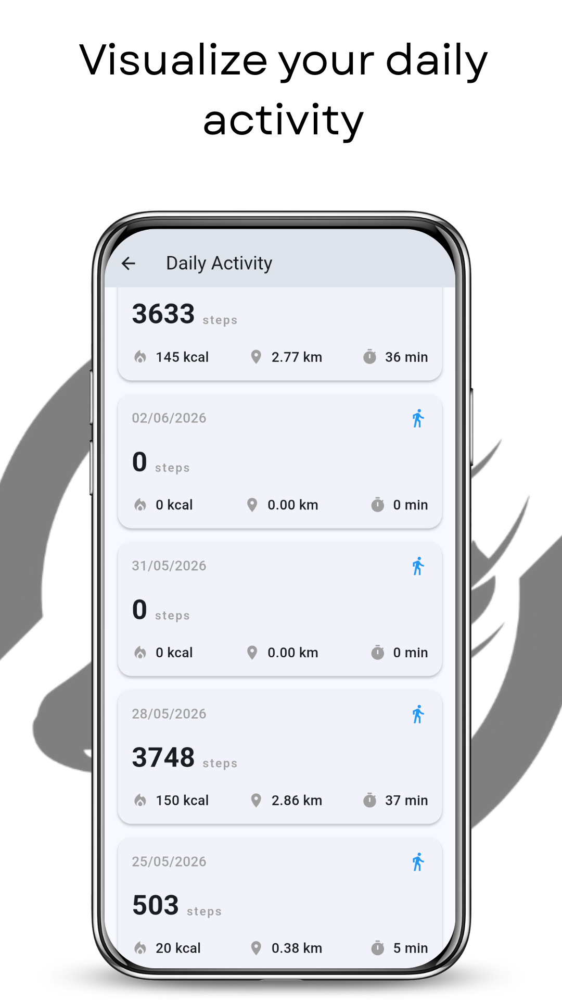
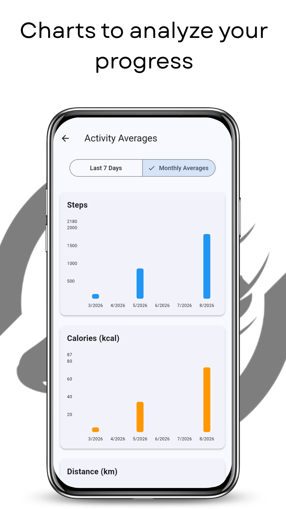
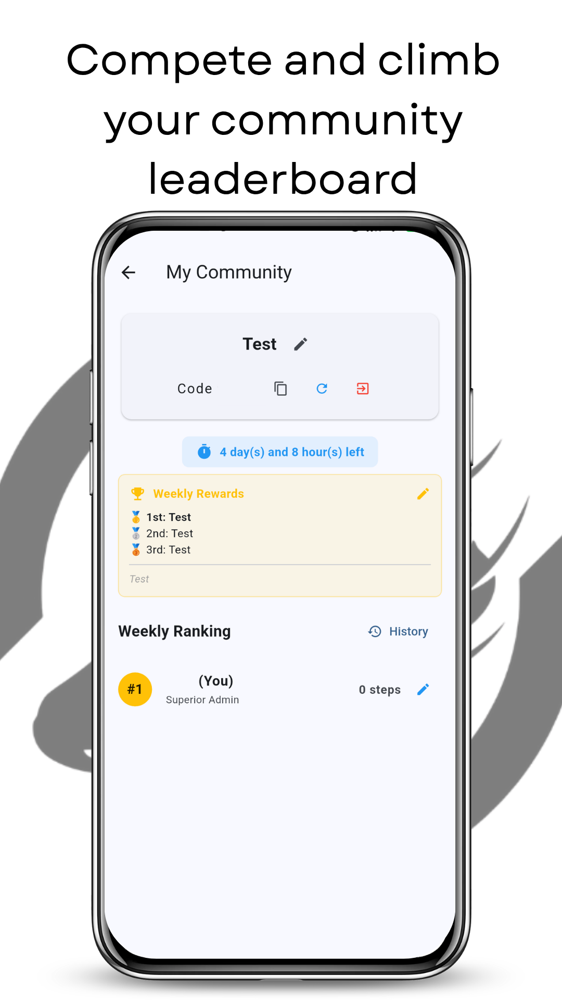

[🇺🇸 English](README.md) | [🇧🇷 Português](README.pt-BR.md) | [🇸🇪 Svenska](README.sv.md) | [🇩🇪 Deutsch](README.de.md) | [🇫🇷 Français](README.fr.md)

---

  

<h1 align="center">YARA - Yet another runner app</h1>

  <b>Does the Play Store really need another running app? Yes.</b> 
  Just the essentials, done exceptionally well. Track your runs and monitor your daily progress simply, directly, and without complications.

  
  

  
  
  
  
  
  

## Features

* **🏃‍♂️ Accurate Run Tracking**
  Start a run and let YARA do the heavy lifting. Track your real-time distance, duration, pace, and calories burned using your device's GPS.

* **📅 Running History**
  Log every drop of sweat. Review your routes on the map, analyze past performance, and keep a detailed record of all your workouts. Share your run card on social media because, let's be honest, if you didn't post it, did it even happen?

* **👟 Smart Pedometer**
  Discover how active you really are throughout the day. YARA automatically counts your steps in the background, converting your movement into real estimates of distance and calories burned.

* **🔗 Health Connect & HealthKit Integration**
  Sync your data securely! YARA connects natively to your phone's health services (Health Connect on Android and HealthKit on iOS) to read and unify your data. Pull your step and workout history from other devices and keep your entire wellness ecosystem in one place.

* **☁️ Cloud Backup & Sync**
  Never lose your progress. Create your account quickly and securely to keep your entire history saved in the cloud. Got a new phone? Just log in and all your data will be right there, intact.

* **📊 Progress Charts**
  For those who take their numbers seriously. Visualize your weekly and monthly averages for steps, calories, distance, and time with interactive charts that help you understand your long-term progress.

* **🌙 Dark Mode & Clean Design**
  A user-friendly, distraction-free interface with full Dark Mode support to save your battery—and your eyes—during those late-night runs.

## Download

Download YARA now, take the first step towards your goals, and transform your routine with the app that knows its place in the world!

## Contributing

YARA is an open-source project. We believe in transparency and collaboration. Feel free to explore the source code, track updates, audit, and contribute to the development directly in our repository.